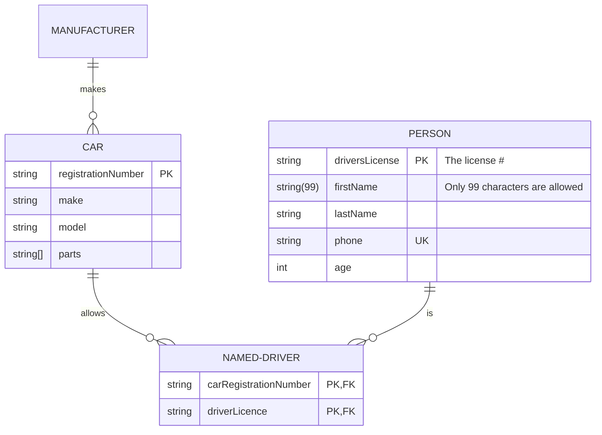

# Assessment for Data Essentials

Answer all. Any queries let me know.

Due 28/8/2024

## Question 1 (20 marks)

Write a brief note on **any 5 of the following** (give examples/diagrams where appropriate):

1. Database relationships
2. The threats faced by a database administrator
3. Domains
4. Layers of data abstraction
5. Data Protection Legislation
6. Referential Integrity
7. Database keys

## Answer 1

## Question 2 (20 marks)

Using the bakery data Dataset spreadsheet, create charts that describe relationships the data.

Upload a Word document that contains the charts. In the Word document, you need to provide a brief description under each chart. Also, upload the excel spreadsheet.

Create one pivot table.

## Question 3 (20 marks)

### Question 3.A (10 marks)

A table (relation) is subject to a number of rules/conditions. What are these?

### Question 3.B (10 marks)

Given the following tables what are the field names, data types, primary keys/Foreign Key. Some to the data will be subject to the following properties: validation rules, default values or required. Indicate which data is subject to those properties and what might they be. Use blank template table below the data.

### Question 3.B.1

**Dog** table

| **DogID** | **Name** | **DateOfBirth** | **Owner**  | **Breed** | **OwnerContact** |
|:----------|:---------|:----------------|:-----------|:----------|:-----------------|
| 1         | Ben      | 01/01/10        | Jim Brady  | Poodle    | 087-654654       |
| 2         | Spot     | 01/01/07        | Paul Smith | Boxer     | 086-111111       |
| 3         | Ruth     | 06/11/09        | Mary Jones | Terrier   | 085-154545       |

### Answer 3.B.1

Entity/Attribute (Table/field)

| **EntityName** | **AttributeName** | **Data Type** | **Size** | **Null/Not Null** | **Constraint** |
|:---------------|:------------------|:--------------|:---------|:------------------|:---------------|
|                | DogID             | integer       | 11       | Not null          | Primary key    |
|                |                   |               |          |                   |                |
|                |                   |               |          |                   |                |
|                |                   |               |          |                   |                |
|                | OwnerContact      | VarChar       | 10       |        Not null           |                |

### Question 3.B.2

*Table 1:*

**DogGrooming** table

| **Grooming** | **DogID** | **Date** | **Time** | **Where** | **Fee** | **Paid** | **Groomer** |
|:-------------|:----------|:---------|:---------|:----------|:--------|:---------|:------------|
| Shampoo      | 1         | 01/05/14 | 11:00    | Office    | €25     | Yes      | Marie       |
| Hair trim    | 2         | 01/05/14 | 12:00    | Home      | €35     | No       | Glen        |
| De-Shedding  | 1         | 02/05/14 | 10:00    | Office    | €45     | Yes      | Marie       |

### Answer 3.B.2

Entity/Attribute (Table/field)

| **EntityName** | **AttributeName** | **Data Type** | **Size** | **Null/Not Null** | **Constraint** |
|:---------------|:------------------|:--------------|:---------|:------------------|:---------------|
|                |                   |               |          |                   |                |
|                |                   |               |          |                   |                |
|                |                   |               |          |                   |                |

## Question 4 (Total 20 marks)

For the description below, you are to:

1. Create a Conceptual Model for the passage below.
2. Create the Logical/Physical E-R diagram, including some attributes (primary keys / foreign keys) and cardinality/modality
3. Prepare a text description explaining your E-R diagram assumptions (max 5 best 3 marked)
4. Write up in English 3 queries (questions) with justification: One involving only one table and the others involving two or more tables
5. What’s missing in terms of other table(s) and fields (attributes).

Hint: Think very carefully about what needs to be recorded. Note that some of the elements in this description may be ‘red herrings’ (i.e. not relevant). Note any decisions you make in your text description of your E-R model. You may assume any further information as is reasonable to complete the assignment. Any such assumptions should be recorded and submitted with your assignment. State any assumptions that you need to make about optional/mandatory relationships.

Moylish Medical Centre is a fast-growing medical practice based on the north side of Limerick city. It provides medical services for a large number of private clients (patients) and for a number of General Practitioners (G.P.s) in the city.

The procedure would be for private clients to come in as per a normal GP practice, for medical check-ups and advise. The client typically rings up the center and makes an appointment to meet one of our six full-time GP’s with the centres two secretaries. The GP assesses the client in the center and will administer the appropriate course of medical care/treatment.

Sometimes a GP has to make a house call. Again details of this visit need to be recorded.

The medical center recently began to offer a small number of medical tests in its newly built biochemistry and hematology laboratory. Demand has been such that they now are offering a large number of biochemistry tests and a small number of core hematology tests. Screening tests for the centers patients are carried out at this laboratory as well as for a number of other GP practices in the area. The samples have to be labeled appropriately by an administration person in the center and are then passed on to the two biochemists who prepare and analyse the specimens and present the findings to the GP’s (if abnormal) or to the administration person to enter in the patients file (if normal).

Each GP is assigned their own room. The Centre employs contract cleaning services to keep the place hygienically clean. They do their work when the centre is closed.

Storing of the medical goods is another problem. A store manager who tries to keep the current stocks within its best before date runs the store. He also tries to minimise the stock held at any given time while ensuring that there is sufficient stock on hand to meet the centres requirements. Details of suppliers of these stock items are also held along with orders that are placed.

Every so often the staff attend conferences/training days. This needs to be recorded. Details of the conference/training day need to be stored, along with who attended. Some of the recorded details of these trips include departure date, return date, and times. Also, a record needs to be kept of any expenses incurred by staff on these trips (the expense name, amount and date).

