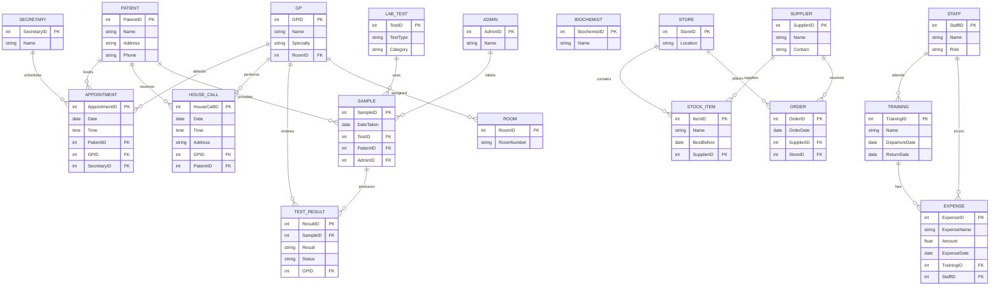
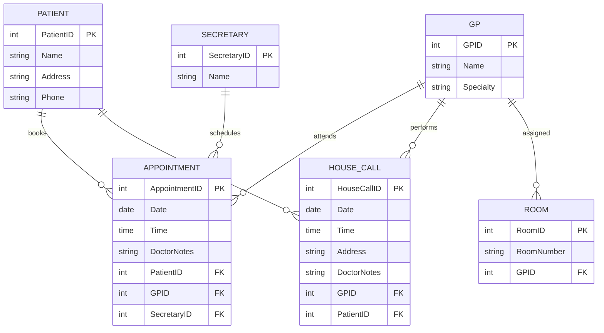
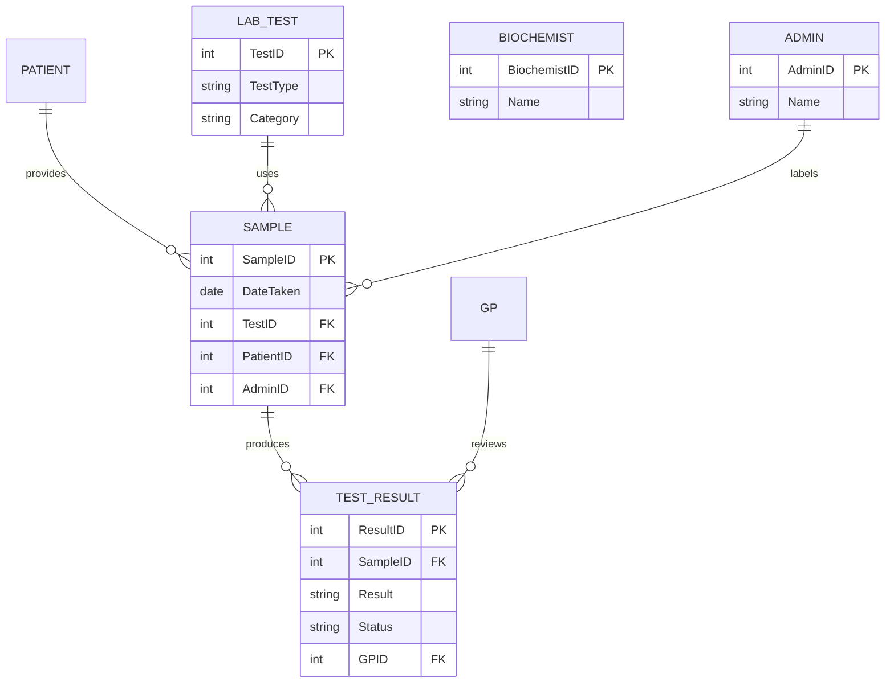


# Assessment for Data Essentials

Answer all. Any queries let me know.

Due 28/8/2024

## Question 1 (20 marks)

Write a brief note on **any 5 of the following** (give examples/diagrams where appropriate):

1. Database relationships
2. The threats faced by a database administrator
3. Domains
4. Layers of data abstraction
5. Data Protection Legislation
6. Referential Integrity
7. Database keys

## Answer 1

1. **Database Relationships**: Database relationships describe how tables in a database are connected to each other. The three primary types of relationships are:
   - **One-to-One**: Each record in one table is linked to one and only one record in another table.
    *Example*: A table of employees may have a one-to-one relationship with a table of employee credentials where each employee corresponds to one set of credentials.
   - **One-to-Many**: A single record in one table is related to multiple records in another table. Example: A table of customers may have a one-to-many relationship with a table of orders, as one customer can place multiple orders.

   Many-to-Many: Multiple records in one table are related to multiple records in another table. This type of relationship is typically implemented using a junction table. Example: A table of students and a table of courses can have a many-to-many relationship, with a junction table storing which students are enrolled in which courses.

1. The Threats Faced by a Database Administrator
Database administrators (DBAs) face several threats that can compromise the integrity, confidentiality, and availability of data:

Security Threats: Unauthorized access, SQL injection attacks, data breaches, and insider threats.
Data Loss: Hardware failures, software bugs, accidental deletions, or corruption of data.
Performance Issues: Database slowdowns due to inefficient queries, improper indexing, or high traffic loads.
Backup Failures: Incomplete or failed backups that may prevent data recovery during a disaster.
Compliance Violations: Failing to adhere to legal and regulatory standards like GDPR, leading to potential fines and penalties.
Example: A hacker exploits a SQL injection vulnerability to gain unauthorized access to sensitive customer data, causing a breach that violates GDPR.

3. Domains
In database management, a domain refers to the set of permissible values that a column in a table can hold. It is essentially the definition of the data type and constraints that apply to a particular field.

Example: If you have a column for the "Age" of a person, the domain could be restricted to integer values between 0 and 120. This ensures data integrity by preventing invalid data, such as negative ages or non-numeric values, from being entered.
Domains help in enforcing data integrity by ensuring that only valid data is stored in a database.

5. Data Protection Legislation
Data protection legislation encompasses laws and regulations that aim to protect personal data from misuse and ensure that organizations handle personal data responsibly.

Example: The General Data Protection Regulation (GDPR) in the European Union imposes strict requirements on how organizations collect, store, and process personal data. It grants individuals rights such as access to their data, the right to be forgotten, and the requirement for explicit consent before data can be processed.
These laws often include provisions for penalties in cases of non-compliance, making it critical for organizations to implement robust data protection measures.

6. Referential Integrity
Referential integrity is a concept used in relational databases to ensure that relationships between tables remain consistent. It enforces rules to maintain the accuracy and consistency of data across relationships.

Example: In a database with a Customers table and an Orders table, referential integrity ensures that every order in the Orders table is linked to a valid customer in the Customers table. If a customer record is deleted, any related orders should either be deleted or reassigned to another customer.
Referential integrity is typically enforced through foreign keys, which create a link between two tables.

## Question 2 (20 marks)

Using the bakery data Dataset spreadsheet, create charts that describe relationships the data.

Upload a Word document that contains the charts. In the Word document, you need to provide a brief description under each chart. Also, upload the excel spreadsheet.

Create one pivot table.

## Question 3 (Total 20 marks)

Complete the GDPR fill in the boxes word document. Upload your completed answer.

## Question 4 (20 marks)

### Question 4.A (10 marks)

A table (relation) is subject to a number of rules/conditions. What are these?

### Answer 4.A

1. Each table must have a unique name.
2. Each field must have a unique name.
3. Each table must have a primary key.
4. Each field must have a data type.
5. Tables are subject to Primary keys, Foreign keys and indexes/constraints.

### Question 4.B (10 marks)

Given the following tables what are the field names, data types, primary keys/Foreign Key. Some to the data will be subject to the following properties: validation rules, default values or required. Indicate which data is subject to those properties and what might they be. Use blank template table below the data.

**Dog** table

| **DogID** | **Name** | **DateOfBirth** | **Owner**  | **Breed** | **OwnerContact** |
|:----------|:---------|:----------------|:-----------|:----------|:-----------------|
| 1         | Ben      | 01/01/10        | Jim Brady  | Poodle    | 087-654654       |
| 2         | Spot     | 01/01/07        | Paul Smith | Boxer     | 086-111111       |
| 3         | Ruth     | 06/11/09        | Mary Jones | Terrier   | 085-154545       |

*Table 1:*

**DogGrooming** table

| **Grooming** | **DogID** | **Date** | **Time** | **Where** | **Fee** | **Paid** | **Groomer** |
|:-------------|:----------|:---------|:---------|:----------|:--------|:---------|:------------|
| Shampoo      | 1         | 01/05/14 | 11:00    | Office    | €25     | Yes      | Marie       |
| Hair trim    | 2         | 01/05/14 | 12:00    | Home      | €35     | No       | Glen        |
| De-Shedding  | 1         | 02/05/14 | 10:00    | Office    | €45     | Yes      | Marie       |

# **Meta-Data**

Document **ALL** your **entity/attributes** from the above two tables with the following format:

### Answer 4.B

*NOTE:* these tables are not normalized and the answers will reflect this

Entity/Attribute (Table/field)

| **EntityName** | **AttributeName** | **Data Type** | **Size** | **Null/Not Null** | **Constraint**  |
|:---------------|:------------------|:--------------|:---------|:------------------|:----------------|
| Dog            | DogID             | INT           | 11       | Not Null          | Primary Key     |
| Dog            | Name              | VARCHAR       | 50       | Not Null          | Composite Key 1 |
| Dog            | DateOfBirth       | DATE          |          | Not Null          | Composite Key 1 |
| Dog            | Owner             | VARCHAR       | 50       | Not Null          | Composite Key 1 |
| Dog            | Breed             | VARCHAR       | 50       | Not Null          |                 |
| Dog            | OwnerContact      | VARCHAR       | 50       | Not Null          |                 |

| **EntityName** | **AttributeName** | **Data Type** | **Size** | **Null/Not Null** | **Constraint** |
|:---------------|:------------------|:--------------|:---------|:------------------|:---------------|
| DogGrooming    | Grooming          | VARCHAR       | 50       | Not Null          |                |
| DogGrooming    | DogID             | INT           | 11       | Not Null          | Foreign Key    |
| DogGrooming    | Date              | DATE          |          | Not Null          | Primary Key 1  |
| DogGrooming    | Time              | TIME          |          | Not Null          | Primary Key 1  |
| DogGrooming    | Where             | VARCHAR       | 50       | Not Null          | Primary Key 1  |
| DogGrooming    | Fee               | DECIMAL       | 10,2     | Not Null          |                |
| DogGrooming    | Paid              | ENUM          | 1        | Not Null          |                |
| DogGrooming    | Groomer           | VARCHAR       | 50       | Not Null          | Primary Key 1  |

## Question 5 (Total 20 marks)

For the description below, you are to:

1. Create a Conceptual Model for the passage below.
2. Create the Logical/Physical E-R diagram, including some attributes (primary keys / foreign keys) and cardinality/modality
3. Prepare a text description explaining your E-R diagram assumptions (max 5 best 3 marked)
4. Write up in English 3 queries (questions) with justification: One involving only one table and the others involving two or more tables
5. What’s missing in terms of other table(s) and fields (attributes).

> Whole

> Section 1

> Section 2

## THe Question Blob

Hint: Think very carefully about what needs to be recorded. Note that some of the elements in this description may be ‘red herrings’ (i.e. not relevant). Note any decisions you make in your text description of your E-R model. You may assume any further information as is reasonable to complete the assignment. Any such assumptions should be recorded and submitted with your assignment. State any assumptions that you need to make about optional/mandatory relationships.

Moylish Medical Centre is a fast-growing medical practice based on the north side of Limerick city. It provides medical services for a large number of private clients (patients) and for a number of General Practitioners (G.P.s) in the city.

The procedure would be for private clients to come in as per a normal GP practice, for medical check-ups and advise. The client typically rings up the center and makes an appointment to meet one of our six full-time GP’s with the centres two secretaries. The GP assesses the client in the center and will administer the appropriate course of medical care/treatment.

Sometimes a GP has to make a house call. Again details of this visit need to be recorded.

The medical center recently began to offer a small number of medical tests in its newly built biochemistry and hematology laboratory. Demand has been such that they now are offering a large number of biochemistry tests and a small number of core hematology tests. Screening tests for the centers patients are carried out at this laboratory as well as for a number of other GP practices in the area. The samples have to be labeled appropriately by an administration person in the center and are then passed on to the two biochemists who prepare and analyse the specimens and present the findings to the GP’s (if abnormal) or to the administration person to enter in the patients file (if normal).

Each GP is assigned their own room. The Centre employs contract cleaning services to keep the place hygienically clean. They do their work when the centre is closed.

Storing of the medical goods is another problem. A store manager who tries to keep the current stocks within its best before date runs the store. He also tries to minimise the stock held at any given time while ensuring that there is sufficient stock on hand to meet the centres requirements. Details of suppliers of these stock items are also held along with orders that are placed.

Every so often the staff attend conferences/training days. This needs to be recorded. Details of the conference/training day need to be stored, along with who attended. Some of the recorded details of these trips include departure date, return date, and times. Also, a record needs to be kept of any expenses incurred by staff on these trips (the expense name, amount and date).
